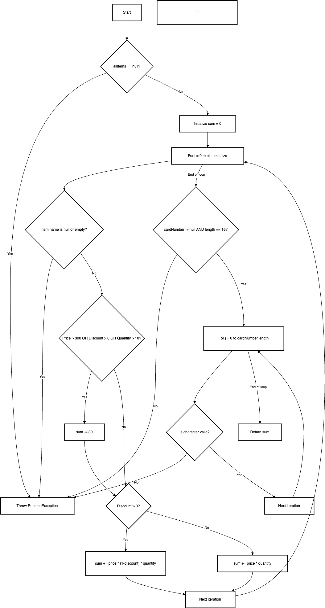

Втора лабораториска вежба по Софтверско инженерство

Марија Дујмовиќ, бр. на индекс 123061

2. Control Flow Graph за функцијата checkCart



3. Цикломатска комплексност

Цикломатската комплексност на функцијата `checkCart` е 8. Ова се пресметува на следниов начин:
 Број на условни изрази (if statements):
   - `if (allItems == null)`
   - `if (item.getName() == null || item.getName().length() == 0)`
   - `if (item.getPrice() > 300 || item.getDiscount() > 0 || item.getQuantity() > 10)`
   - `if (item.getDiscount() > 0)`
   - `if (cardNumber != null && cardNumber.length() == 16)`
   - `if (allowed.indexOf(c) == -1)`
 Број на логички оператори (&&, ||):
   - `item.getName() == null || item.getName().length() == 0`
   - `item.getPrice() > 300 || item.getDiscount() > 0 || item.getQuantity() > 10`
   - `cardNumber != null && cardNumber.length() == 16`

Вкупен број = 6 условни изрази + 2 логички оператори = 8

Секој условен израз и логички оператор додава една дополнителна патека во кодот, што значи дека има 8 различни патеки низ кои кодот може да тече.

## 4. Тест случаи според Every Statement критериумот

За да се постигне Every Statement критериумот, потребни се минимално 2 тест случаи. Ова е затоа што:
1. Првиот тест случај треба да ги изврши сите statements во главниот дел од кодот
2. Вториот тест случај треба да ги изврши statements во делот за валидација на картичката

Тест случај 1: Валиден предмет со попуст
```java
List<Item> items = new ArrayList<>();
items.add(new Item("Item1", 5, 400, 0.1));
String cardNumber = "1234567890123456";
double result = checkCart(items, cardNumber);

```

Овој тест случај ги извршува следниве statements:
- Иницијализација на sum
- Проверка на името на предметот
- Проверка на цената, попустот и количината
- Додавање на попуст
- Пресметка на вкупната сума
- Валидација на бројот на картичката

### Тест случај 2: Валиден предмет без попуст
```java
List<Item> items = new ArrayList<>();
items.add(new Item("Item2", 3, 200, 0)); 
String cardNumber = "1234567890123456";
double result = checkCart(items, cardNumber);

```

Овој тест случај ги извршува следниве statements:
- Иницијализација на sum
- Проверка на името на предметот
- Проверка на цената, попустот и количината
- Пресметка на вкупната сума без попуст
- Валидација на бројот на картичката

Со овие два тест случаи се извршуваат сите statements во кодот:
1. Сите иницијализации
2. Сите проверки на услови
3. Сите пресметки
4. Сите валидации на картичката
5. Сите return statements

5. Тест случаи според Multiple Condition критериумот

За условот `if (item.getPrice() > 300 || item.getDiscount() > 0 || item.getQuantity() > 10)`, според Multiple Condition критериумот потребни се 4 тест случаи. Ова е затоа што имаме 3 услови поврзани со OR оператор, и според Multiple Condition критериумот потребни се n+1 тест случаи, каде n е бројот на услови.

### Тест случај 1: Сите услови се false
```java
List<Item> items = new ArrayList<>();
items.add(new Item("Item1", 5, 200, 0)); // price <= 300, discount = 0, quantity <= 10
String cardNumber = "1234567890123456";
double result = checkCart(items, cardNumber);
// Очекуван резултат: 1000.0 (200 * 5)
```

### Тест случај 2: Првиот услов е true
```java
List<Item> items = new ArrayList<>();
items.add(new Item("Item2", 5, 400, 0)); // price > 300, discount = 0, quantity <= 10
String cardNumber = "1234567890123456";
double result = checkCart(items, cardNumber);
// Очекуван резултат: 1970.0 (400 * 5 - 30)
```

### Тест случај 3: Вториот услов е true
```java
List<Item> items = new ArrayList<>();
items.add(new Item("Item3", 5, 200, 0.1)); // price <= 300, discount > 0, quantity <= 10
String cardNumber = "1234567890123456";
double result = checkCart(items, cardNumber);
// Очекуван резултат: 870.0 (200 * 0.9 * 5 - 30)
```

### Тест случај 4: Третиот услов е true
```java
List<Item> items = new ArrayList<>();
items.add(new Item("Item4", 15, 200, 0)); // price <= 300, discount = 0, quantity > 10
String cardNumber = "1234567890123456";
double result = checkCart(items, cardNumber);
// Очекуван резултат: 2970.0 (200 * 15 - 30)
```

Секој тест случај тестира различна комбинација на услови:
1. Првиот тест случај проверува кога сите услови се false
2. Вториот тест случај проверува кога само цената е поголема од 300
3. Третиот тест случај проверува кога само попустот е поголем од 0
4. Четвртиот тест случај проверува кога само количината е поголема од 10

Со овие 4 тест случаи се опфатени сите можни комбинации на услови според Multiple Condition критериумот.

4.  

